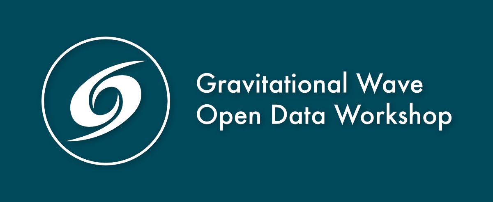

# Gravitational Wave Open Data Workshop

Welcome to the Gravitational Wave Open Data Workshop.
Here you will find the support material for the [Gravitational Wave Open Data Workshop](https://learn.gwosc.org) (ODW)
organized by the [Gravitional Wave Open Science Center](https://gwosc.org) (GWOSC).
This material consists on several interactive Jupyter notebooks in the [Tutorials folder](./Tutorials/), divided into topics, grouped into folders for each day of the workshop.
There are also some quiz questions that you are asked to complete at the end of each topic.
Lastly, test yourself with the GW Data Challenge!

For questions concerning the software setup, the tutorials, the workshop in general, or even for GW science questions, join our community at the [ask.igwn.org](ask.igwn.org) forum.
Before posting new questions, check first if a similar question was already asked in the [_Open Data Workshop_ category](https://ask.igwn.org/c/open-data-workshop/5).

## Software setup

Before you dive into the notebooks, we recommend first taking a look at the [setup guide](./setup.md),
where you will find information to configure the workspace where you will be executing the tutorials.

We describe in the setup guide several options on how to run the notebooks.
Each option is marked according to their difficulty and OS dependency.
Feel free to pick the one that best suits your needs.

## Hands-on sessions

The [tutorials](./Tutorials/) are divided in three folders for each day of hands-on sessions. In there, you can find a summary of their topics.

## Data Challenge

In the [Challenge folder](./Challenge) you can find a list of _challenges_, ordered by difficulty.
Participants can complete them individually or in teams, and submit their answers accordingly.
